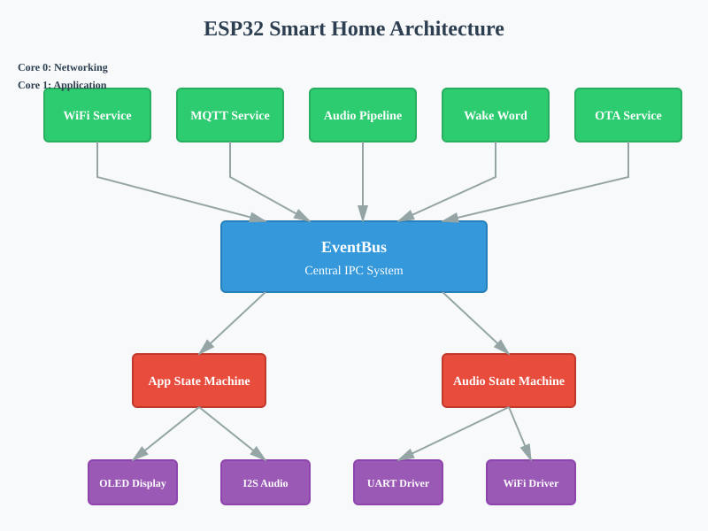

ESP32 Smart Home Documentation
==============================

.. toctree::
   :maxdepth: 2
   :caption: Contents:

   getting-started
   architecture
   api/index
   development
   deployment

.. note::
   **Additional Resources:**
   
   - `Doxygen API Reference <doxygen/index.html>`_
   - `GitHub Repository <https://github.com/sprchuoi/smart_home_idf>`_
   - `Report Issues <https://github.com/sprchuoi/smart_home_idf/issues>`_

Welcome to the ESP32 Smart Home firmware documentation!

This is a production-ready, low-power, real-time, voice-activated ESP32 smart home firmware with:

* **Dual-core FreeRTOS architecture** - Optimized task allocation across cores
* **Audio DMA pipeline** - I2S audio capture with ESP-SR wake word detection
* **Power management** - Sleep modes with multiple wake-up sources
* **HTTPS OTA updates** - Secure over-the-air firmware updates
* **Home Assistant integration** - MQTT auto-discovery
* **Task watchdog** - Real-time task monitoring
* **Thread-safe IPC** - Event-driven architecture

Quick Start
-----------

.. code-block:: bash

   # Setup environment
   ./make.sh setup

   # Build project
   ./make.sh build

   # Flash and monitor
   ./make.sh flash-monitor

Features
--------

.. list-table::
   :header-rows: 1

   * - Feature
     - Description
   * - Multi-Core Design
     - Core 0: Networking (WiFi, MQTT, OTA). Core 1: Application (Audio, State Machine)
   * - Audio Pipeline
     - I2S DMA capture with ring buffer, ESP-SR wake word detection
   * - Power Management
     - NORMAL, MODEM_SLEEP, LIGHT_SLEEP modes with wake-up sources
   * - OTA Updates
     - HTTPS OTA with progress reporting and rollback protection
   * - Home Assistant
     - MQTT auto-discovery, QoS 0 communication
   * - Task Watchdog
     - Monitors 5 critical tasks with safe reset on timeout

Architecture Overview
---------------------

The system uses an event-driven architecture with:

* **EventBus**: Central IPC system using FreeRTOS queues
* **State Machines**: Application and Audio state coordination
* **Services**: Decoupled services communicating via events
* **Drivers**: Hardware abstraction layer

   System Architecture Overview

Indices and tables
==================

* :ref:`genindex`
* :ref:`modindex`
* :ref:`search`

